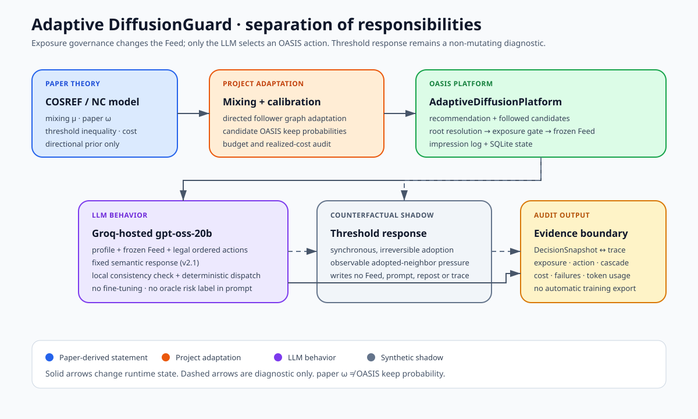
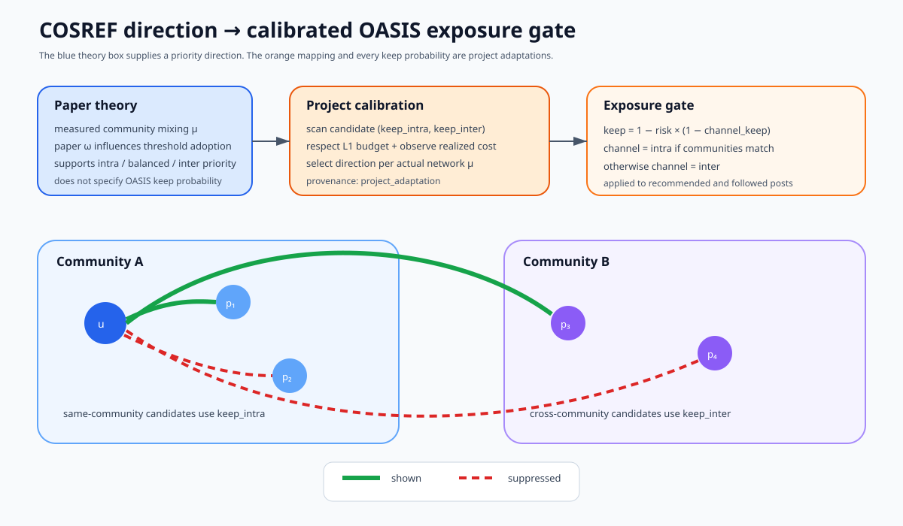
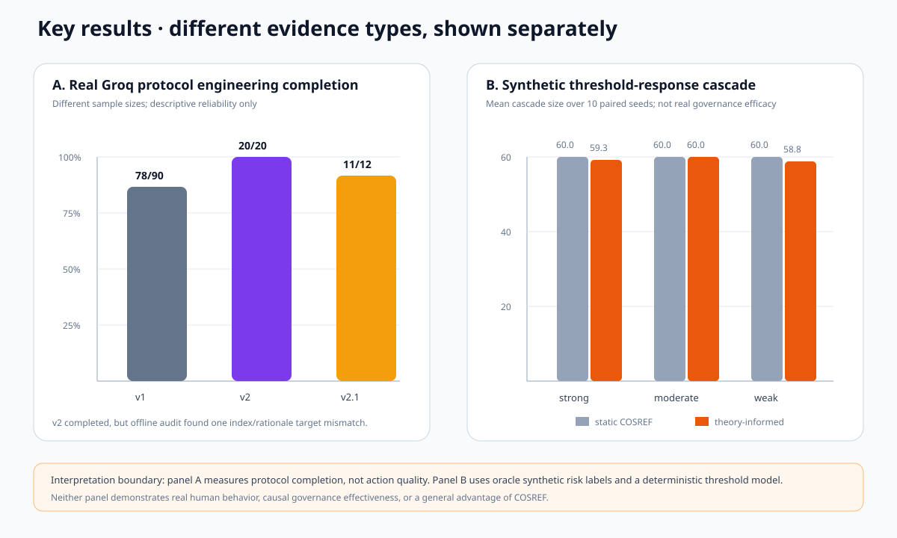

# Adaptive DiffusionGuard

First runnable research scaffold for exposure-level diffusion governance on
top of [OASIS](https://github.com/camel-ai/oasis). It is a separate project;
the OASIS source tree is not patched.

本项目研究在保持模型、合成 Agent profile 和动作接口不变时，网络层社区内外曝光
策略如何改变 Agent 看到的内容、合法动作和后续合成传播。它是可复现研究原型，不是
生产系统，也不把 LLM Agent 当作真实人类。

**冻结状态：** 最后一次 `fixed-choice-semantic-v2.1` 真实 Groq micro-pilot 完成
**11/12** 个决策；未完成决策为 provider `json_validate_failed`，不是 dispatcher
失败。项目不再开发 v2.2、不重跑或扩大真实实验，也没有进行 LoRA/QLoRA 微调。



## System boundaries

| Component | Responsibility | Boundary |
|---|---|---|
| OASIS | Social graph, posts, follow relationships, platform actions and trace | Does not supply COSREF mapping or real risk labels |
| Adaptive platform | Govern recommendation and followed-content exposure; resolve roots; log impressions | Does not change model weights |
| COSREF controller | Allocate within/between-community exposure retention under a budget | Does not choose user actions |
| LLM Agent | Choose among current legal actions from profile, Feed and history | Does not see policy name, mixing parameter, paper omega or oracle risk labels |
| Threshold response | Offline/shadow diagnostic for synchronous multi-neighbor adoption | Never competes with the LLM or writes actions in joint runs |



## Reproducible upstream dependency

OASIS is installed from a Git direct reference pinned to the commit
recorded in `OASIS_COMMIT`:

```text
ca8caa52aeec21e0db30926797e765ad07e75015
```

Verify the installed package source before a run:

```bash
python scripts/verify_oasis_commit.py
```

The verifier reads package `direct_url.json`; no sibling checkout is required.

OASIS declares Python `>=3.10,<3.12`; use Python 3.11. Its full runtime pulls
PyTorch, CAMEL, sentence-transformers, and related dependencies.

## What is implemented

`AdaptiveDiffusionPlatform(Platform)` overrides both `update_rec_table()` and
`refresh()`. The final refresh path takes recommendation candidates and posts
from followed users, applies the same policy to both, records every candidate
(shown or suppressed), and only then builds the feed. Reposts and quotes are
walked through `original_post_id` to the root post, whose author community and
risk score drive the decision.

The static policy computes:

```text
omega = omega_intra if user and root author share a community else omega_inter
keep_probability = 1 - risk_score * (1 - omega)
```

In this project, COSREF parameters are operationalized as **exposure keep
probabilities**. This is not evidence that they are mathematically or
empirically identical to an effective spreading rate in any prior paper.

The normalized `diffusionguard_impression` table includes `run_id`,
`timestep`, `user_id`, `post_id`, `root_post_id`, both community fields,
`base_score`, `risk_score`, both omega values, `keep_probability`, `shown`, and
the candidate source.

`RuleBasedController` implements the common `Controller` interface. At fixed
intervals it consumes risk adoption, new reposts, community coverage,
cross-community exposure, reports, benign exposure loss, cumulative cost, and
remaining budget. It clips parameters to `[0, 1]` and scales each proposed
change to the shared remaining budget. The interface is intentionally suitable
for a later MPC controller; reinforcement learning is not implemented.

Four experiment baselines share the same config and budget definition:

1. `no_intervention`
2. `global_throttle`
3. `static_cosref`
4. `dynamic_cosref`

The included smoke experiment generates a fixed-seed 80-node, four-community
SBM with risky and benign root posts. It uses scripted agents on CPU. It does
**not** claim that those agents are LLMs.

## LLM providers and safeguards

`adaptive_diffusionguard.llm.model_factory.create_llm_model()` is the only
model-construction entry point. `DIFFUSIONGUARD_ENABLE_LLM=false` returns no
remote backend. Supported providers are `groq` (default) and `openai`; each
requires its own API key and there is no credential remapping or silent
fallback. CAMEL 0.2.90 has a native Groq backend and accepts string model IDs,
so Groq uses `ModelPlatformType.GROQ` directly.

The managed backend enforces exponential retry for HTTP 429, timeout, and 5xx
errors; request spacing; bounded concurrency; a hard per-run remote-call cap;
a local SQLite response cache; and usage accounting. Token counts are reported
as `unavailable` when omitted. Cache keys include model, temperature, system
prompt and all other messages, tools, and the complete output format. For the
validation path this includes the current legal `choice_id` enum, so state
changes cannot reuse a response produced under another action mask. Keys and
logs never contain API credentials.

The legacy v8 teacher-validation path does not expose OASIS actions as model tools.
Before every decision it refreshes the feed, derives a legal action mask from
the current OASIS SQLite state, and sends Groq a strict `json_schema` response
format with exactly `choice_id` and `rationale`. The dynamic `choice_id` enum
contains `ignore` plus only currently legal visible-post actions. A strict
Pydantic validator and deterministic local dispatcher then map the selected
choice to OASIS. Invalid responses and dispatch failures are recorded as
failures; they are neither converted to `ignore` nor exported as teacher data.

The mask mirrors OASIS 0.2.5 behavior: repost is excluded when the same user
has already reposted the target (and also the root when the visible target is
a repost); report is excluded after the same user reports the same visible
post. OASIS `quote_post` explicitly permits repeated quotes because their text
may differ, so quote remains available for every existing visible post. The
mask is rebuilt before every request and rechecked immediately before dispatch.
The standalone dataset teacher parser retains its documented one-repair safe
fallback, but that fallback is not used by real OASIS validation.

### Versioned joint-experiment protocols

The joint experiment kept every protocol version and failure record:

1. **v1, dynamic choice enum:** the provider schema contained the current legal
   `choice_id` enum. The real run completed 78/90 decisions; corrected offline
   accounting attributes 12 final failures to the provider and none to the
   dispatcher.
2. **v2, fixed choice index:** the model returned an integer index into an
   ordered action list. Its real micro-pilot completed 20/20, but one response
   executed `report:2` while its rationale explicitly discussed post 3. This is
   evidence that an integer alone does not establish semantic binding.
3. **v2.1, fixed semantic redundancy:** the fixed schema returned
   `choice_index`, `action_type`, `target_post_id`, `quote_text`, and
   `rationale`. Local checks required the index, action, and direct target to
   describe the same legal option. Eleven successful real responses passed;
   one of twelve decisions ended in provider HTTP 400
   `json_validate_failed`. The final status is therefore **11/12, degraded**.

The v2.1 model was Groq-hosted `openai/gpt-oss-20b`, an existing model that was
not fine-tuned by this project. Real-run rationales remain
`rationale_training_eligible=false` and no training samples were produced.



Release-facing aggregate results are available in
[`docs/results/README.md`](docs/results/README.md). They contain only
protocol-level and theory-validation summaries; raw databases, prompts,
rationales, profiles, caches and logs remain excluded.

## Setup and commands

From this directory:

```bash
uv venv --python 3.11
uv sync --extra test
source .venv/bin/activate
```

Create the local environment file from the secret-free template:

```bash
cp .env.example .env
```

Keep `.env` local and set only the values needed for remote validation:

```ini
DIFFUSIONGUARD_ENABLE_LLM=true
# Set GROQ_API_KEY to your own value in this local file only.
```

Never copy a populated `.env` back into `.env.example` or commit `.env`.

The optional Groq configuration selects a hosted provider only. The default
model ID `openai/gpt-oss-20b` names a Groq-hosted, pre-existing model; it was
not trained or fine-tuned in this repository. The project is frozen, so the
presence of remote entry points is not authorization to rerun the pilots.

One command to run tests:

```bash
uv run pytest
```

One command to run the minimum simulation:

```bash
uv run python -m adaptive_diffusionguard.experiments.run \
  --config configs/smoke.toml --baseline static_cosref \
  --output /private/tmp/adaptive-diffusionguard-portfolio-smoke
```

Use `--baseline all` to run all four baselines. Summaries are descriptive smoke
outputs, not research conclusions.

One command to build a validated demo JSONL dataset:

```bash
uv run python -m training.build_dataset --demo \
  --label-source teacher_synthetic --output runs/training/actions.jsonl
```

For new OASIS runs, replace `--demo` with `--oasis-db PATH`. The builder requires
the project-owned `diffusionguard_decision_snapshot` table and exports only
records whose status is `succeeded` and whose OASIS action trace is bound
one-to-one. It will not infer model input from an action trace.

Older databases without native snapshots require an explicit, fail-closed
reconstruction. The refresh and action traces must match uniquely by user,
timestep, and event order:

```bash
uv run python -m training.build_dataset \
  --oasis-db runs/real-llm-v8/real_llm_validation.db \
  --legacy-refresh-reconstruction \
  --legacy-teacher-source runs/real-llm-v8/groq_teacher_trajectories.jsonl \
  --quality-audit runs/real-llm-v8/teacher_quality_audit.json \
  --output runs/real-llm-v8/groq_teacher_trajectories.corrected.jsonl \
  --report-output runs/real-llm-v8/dataset_reconstruction_report.json

uv run python scripts/validate_teacher_dataset.py \
  runs/real-llm-v8/groq_teacher_trajectories.corrected.jsonl \
  --database runs/real-llm-v8/real_llm_validation.db
```

Legacy provenance is explicitly marked and is not equivalent to a native
DecisionSnapshot. The validator exits non-zero for ambiguous matches, label
leakage, invalid history ordering, missing bindings, or credential patterns.
`observed` means a recorded action in the supplied trajectory; it does not mean
a real human action unless the source data independently establishes that.
Teacher-generated labels must use `teacher_synthetic`. Training on them is
described here as **behavior distillation**, never as learning true human
behavior.

Generate behavior-distillation labels with the configured provider:

```bash
uv run python -m training.build_dataset \
  --teacher-input runs/training/actions.jsonl \
  --output runs/training/teacher-actions.jsonl
```

Run the bounded real validation only after creating a local, ignored `.env`
with `DIFFUSIONGUARD_ENABLE_LLM=true` and the provider-specific key:

```bash
uv run diffusionguard-real-llm --output runs/real-llm
```

This entry point is fixed at 5 synthetic LLM agents, 3 time steps, no more
than 30 physical remote attempts, concurrency at most 1, a fixed seed, and an
enabled cache. Its summary status is `success`, `degraded`, or `failed`;
degraded and failed validations return a non-zero exit code. Missing `.env` or
credentials cause an exit before model creation. Teacher requests use
temperature `0.0`, `max_tokens=512`, strict structured outputs, and no `tools`
or `tool_choice` request fields.

One command for the model-free LoRA pipeline dry-run:

```bash
uv run python -m training.train_lora \
  --config training/configs/dry_run.toml \
  --dataset runs/training/actions.jsonl \
  --output runs/training/dry-run --dry-run
```

The dry-run validates config, examples, label provenance, strict JSON targets,
CPU-safe tokenization, prompt rendering, and prompt-label masking. It downloads
no model and performs no optimization. A cloud example is provided in
`training/configs/cloud_lora.toml`. For
actual adapter training, install `--extra training`, set `[model].name`, and
omit `--dry-run`. QLoRA additionally requires a supported Linux/CUDA setup and
`--extra qlora`. The training path saves `adapter/` via PEFT and does not save a
second full base model by default.

Evaluate a prediction JSONL whose rows contain `label`, `output`, and
`latency_seconds`:

```bash
uv run python -m training.evaluate_actions --predictions predictions.jsonl
```

It reports Action Macro-F1, strict JSON validity, Brier score, and mean
per-sample inference time. `CascadeMetric` and `CascadeSize` provide the first
cascade-level interface and test; no cascade experiment result is claimed.

## Offline 100-decision teacher evaluation

`configs/teacher_eval_100.json` defines 20 independent synthetic scenarios.
Each scenario has its own SQLite database and run ID, five synthetic agents,
and one decision per agent. Its rubric is a synthetic rule-based evaluation
rubric, not a human-behavior gold standard.

```bash
uv run diffusionguard-teacher-eval \
  --suite configs/teacher_eval_100.json \
  --backend fake \
  --output runs/teacher-eval-100-fake
```

The local backends are `fake`, `random_legal`, and
`deterministic_risk_rule`. A future `groq` run uses the existing managed model
runtime and is accepted only when remote LLM use is explicitly enabled with a
provider-specific credential. Each batch has four scenarios, a separate
output/cache namespace, a hard limit of 30 physical requests, and a completion
marker. `--resume` resumes only at complete batch boundaries.
Formal benchmark data always uses native `DecisionSnapshot` rows and never the
legacy refresh-trace reconstruction.

Remote evaluation must select exactly one batch. Inspect the safe plan before
allowing any provider call:

```bash
uv run diffusionguard-teacher-eval \
  --suite configs/teacher_eval_100.json \
  --backend groq --batch batch-01 \
  --output runs/teacher-eval-100-groq --plan
```

Plan mode reads only the suite and creates no output, cache, database, or
model. A resumed complete batch is accepted only after its config hash, JSONL
files, decision identities, and scenario databases pass integrity checks. An
incomplete batch is moved intact to a timestamped `quarantine/` directory and
restarted from its batch boundary; a changed suite hash is refused.

The suite reports reliability, action quality, and data integrity separately;
it does not collapse them into a single accuracy number. Rationale text stays
in a manual factual-review queue and is not marked training-eligible by this
engineering benchmark.

## Configuration and data rules

All communities, post risks, random seeds, omega values, controller targets,
and budgets come from config or supplied mappings. Missing user/author
communities or root-post risk scores fail the refresh rather than silently
guessing. Benign content must therefore carry an explicit risk score of zero.
The shared intervention cost is the L1 reduction from the no-intervention
point: `(1 - omega_intra) + (1 - omega_inter)`. Initial static/global settings
and subsequent dynamic changes draw from the same configured budget. The
upstream `rec` table contains no base scores, so this project logs a documented
rank/like proxy rather than inventing an OASIS model score.

## COSREF theory bridge and observed stages

COSREF comes from Chen et al., *Community structure-regulation coupling reveals
optimal information diffusion*, Nature Communications 17, 4879 (2026),
[DOI 10.1038/s41467-026-73665-1](https://doi.org/10.1038/s41467-026-73665-1).
The verified paper model defines community mixing, within/between-community
influence weights, threshold adoption, and intervention cost. The project adds
the directed-OASIS network adaptation, exposure calibration, keep-probability
mapping, and platform metrics.

**Paper omega is not mathematically equal to OASIS keep probability.** The
official v1.0.0 reference slice is a small directional check, not a reproduction
of the full paper. Project keep values are labelled `project_adaptation`.

| Stage | Actual scope | Observed result |
|---|---:|---|
| OASIS smoke | 80 nodes, four communities, three timesteps | CPU-safe scripted run passed; no LLM |
| Official-code reference slice | `N=2000`, two mixing conditions, fixed seed | Community-control direction agreed with the checked supplementary result |
| Robustness pilot | 75 calibration + 150 evaluation runs | Risk exposure reduction was stable against no intervention; allocation direction and exact keep choice were not stable in all conditions |
| Threshold-response v1 | 135 calibration + 150 evaluation runs, 60 nodes, eight timesteps | Paper-native direction check passed; strong/weak conditions showed small synthetic propagation differences, moderate was unchanged |
| Joint LLM v1 | 90 real decisions | 78/90, degraded |
| Joint LLM v2 | 20 real decisions | 20/20, but one index/rationale target mismatch was found offline |
| Joint LLM v2.1 | 12 real decisions | 11/12, degraded; one final provider schema-validation error |

These stages do not establish a ranking of governance policies. See
[`docs/PROJECT_FINAL_STATUS.md`](docs/PROJECT_FINAL_STATUS.md),
[`docs/PORTFOLIO_SUMMARY.md`](docs/PORTFOLIO_SUMMARY.md), and
[`docs/RESUME_BULLETS.md`](docs/RESUME_BULLETS.md).

Adaptive DiffusionGuard's original work is released under the
[`Apache License 2.0`](LICENSE). The license boundary, citations and third-party
provenance are documented in
[`docs/THIRD_PARTY_NOTICES.md`](docs/THIRD_PARTY_NOTICES.md).

## Limitations and run status

- LLM agents cannot directly represent real humans. Their outputs are model
  behavior under prompts and platform context, not evidence of human behavior.
- The included smoke simulator uses zero LLM agents. The separate real
  validation is opt-in and requires a provider-specific key.
- No external API call, teacher-label generation, GPU training, QLoRA run, or
  high-cost experiment is performed by default.
- Groq teacher outputs are behavior-distillation labels, not human labels.
- API use requires `GROQ_API_KEY` or `OPENAI_API_KEY` and may incur provider
  cost or free-tier limits. Local training requires model weights, disk/RAM,
  and usually a GPU.
- This scaffold validates software behavior on a synthetic network. It does
  not establish misinformation mitigation efficacy or a paper-level result.
- All reported risk labels in the governance pilots are oracle synthetic labels;
  zero benign loss under them is not evidence of real classifier performance.
- The final v2.1 real run completed 11/12, not 12/12. It cannot be represented
  as production reliability or silently completed from other runs.
- The threshold experiments are synthetic mechanism checks. LLM behavior does
  not equal human behavior, and threshold shadow predictions are not actions.

The exact frozen status is recorded in `docs/PROJECT_FINAL_STATUS.md`; this
README does not turn unexecuted designs into results.

## Reproducibility, provenance, and licenses

- `uv.lock` fixes the resolved environment. OASIS 0.2.5 is pinned to commit
  `ca8caa52aeec21e0db30926797e765ad07e75015`; CAMEL is locked at 0.2.90.
- Run configurations, random seeds, config hashes, SQLite databases, raw
  decision records, and complete markers are retained locally under `runs/`.
- `.env`, response caches, virtual environments, logs, databases, and `runs/`
  are ignored. `.env.example` contains empty secret fields only.
- OASIS and CAMEL state Apache-2.0 licenses. Groq is an external service whose
  use is governed by its service terms.
- COSREF official code was checked at v1.0.0 commit
  `9629dd7a7adecaadfffd53f2ae0f3a28a75a54eb`; the downloaded Zenodo archive
  SHA-256 is
  `c78f746b3b4dc3566f63e6015ff9019ec8dc5e077d93bd22bfcb2a324109a253`.
  The inspected archive record did not provide a verifiable explicit license,
  so its code was used only as an isolated reference oracle and was not copied
  into the production package.

Full provenance and source hashes are in
[`docs/THIRD_PARTY_NOTICES.md`](docs/THIRD_PARTY_NOTICES.md). The publication
whitelist and manual Git handoff are in
[`docs/RELEASE_CHECKLIST.md`](docs/RELEASE_CHECKLIST.md).

## Upstream contribution assessment

A small generic post-merge recommendation/exposure hook is suitable for OASIS;
COSREF-specific logic is not. A focused issue and PR proposal draft is in
[`docs/oasis-upstream-proposal.md`](docs/oasis-upstream-proposal.md). Nothing
has been submitted upstream.
